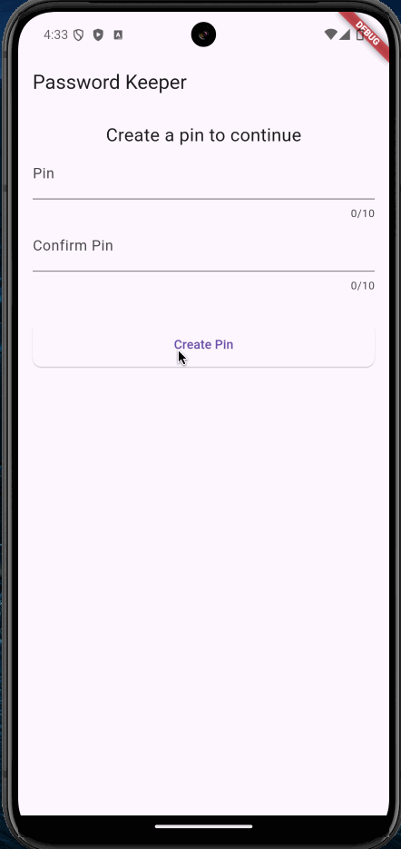

[](https://classroom.github.com/a/H8mPu996)
# DMIT2504 Assignment 04 - Advanced Input & Local Storage

**Weight:** 10% of final mark

**Submission requirements:** On or before the deadline, push your final solution to the GitHub repository. **You must commit and push to the classroom assignment repository supplied for the assignment**; do not create your own repository. It is your responsibility to ensure that your work is in the correct repository. **_Work not in the repository will not be graded_**.

## Password Keeper

This assignment will assess your abiltiy to perform advanced input tasks (e.g. validation) and store data. The password keeper app must provide the user the ability to authenticate prior to accessing the password storage interface. On first use, the user will be prompted to create a pin for the app. Once a pin has been created, the user will be presented with the auth form. On subsequent runs, the app will display the auth form first -- the prompt for a new pin should only be presented on the first run. As the app deals with sensitive data, you will need to incorporate [encryption](https://en.wikipedia.org/wiki/Encryption) into the solution. Much of the application has been provided to you; you will need to complete the missing pieces. Throughout the development of this app, use the automated tests as a guide (`$ flutter test -r expanded automated_tests_do_not_touch`).

The requirements for the app are presented below.

### Storage Requirements

Each file has specific requirements for you to fulfill, which are marked with TODO comments in the code. _NOTE: You can find all the TODO comments in the PROBLEMS tab in VS Code._

1. Create a `PasswordAccountDbManager` Class

- Create this widget in the `lib/data/` directory (you will need to create the directory). It will work with the `PasswordAccount` class (found in the `lib/models/` directory).
- The class must provide access to a SQLite database on the device. Use the following SQL statement to create the database:

```sql
CREATE TABLE accounts (site TEXT PRIMARY KEY, username TEXT, password TEXT, notes TEXT)
```

- The class must expose the following methods:

   - `createAccount(PasswordAccount pa) -> Future<int>`: the method accepts a single `PasswordAccount` object and creates the record in the database. The method should throw an exception if the operation fails. The method should return the id of the created record.
  - `updateAccount(PasswordAccount pa) -> Future<int>`: the method accepts a single `PasswordAccount` object and updates the record in the database. The method should throw an exception if the operation fails. The method should return the number of changes made.
  - `deleteAccount(PasswordAccount pa) -> Future<int>`: the method accepts a single `PasswordAccount` object and deletes the record in the database. The method should throw an exception if the operation fails. The method should return the number of rows affected.
  - `getAllAccounts() -> Future<List<PasswordAccount>>`: the method returns a list of all `PasswordAccount`s from the database, ordered by site. The method should throw an exception if the operation fails.
  - `getAccount(String site) -> Future<PasswordAccount?>`: the method accepts a single `String` (site) and returns the `PasswordAccount` from the database, `null` if no record was found. The method should throw an exception if the operation fails.

- The class must include the following method for testing purposes:

  ```dart
  void setDatabase(Database value) {
    _database = value;
  }
  ```

  where `_database` is whatever you named the static database member.

- The class is only responsible for reading from and writing to the database. Ensure that all data saved to the database is **encrypted** before being passed to create or update methods. Ensure that all data read from the database is **decrypted** after being returned from the database. Use the provided encryption functions in the `lib/utils/encrypter.dart` library in the appropriate locations (e.g. encrypt in the `AccountPage` and decrypt in the `AccountDetails` and `AccountsPage`).

2. Create a pin services library to manage the user's PIN for the app

- Create this library in a `pin_services.dart` file in the `lib/services/` directory (you will need to create the directory).
- The library must use the `shared_preferences` package to manage the user's pin.
- The library must expose the following functions:
  - `hashPin(String pin) -> String`: the function accepts a single `String` (pin) and returns its hash value
    - Use the provided `hash(String text)` function provided in the `lib/utils/encrypter.dart` library.
  - `storePin(String pin) -> Future<void>`: the function accepts a plain text PIN value and will store it using shared_preferences with the key `pin`.
    - The PIN cannot be stored in plain text, it must be encrypted. Use the previous `hashPin()` function and then store the hashed value.
  - `checkPin(String pin) -> Future<bool>`: the function accepts a single `String` (pin) and compares its hashed value with the stored pin hash value from shared_preferences. The function returns `true` if the hashes match and returns `false` if they do not match.
  - `pinStored() -> Future<bool>`: the function checks shared_preferences for the existence of a pin. The function returns `false` if no pin is found, the function returns `true` if the pin is found.

### Advanced Input Requirements

1. Home Page [lib/pages/home.dart]

- There is one task for you to complete in this widget
  1. Check for a stored pin and set state accordingly

2. CreatePin Widget [lib/widgets/create_pin.dart]

- There are three tasks for you to complete in this widget
  1. Create and manage the necessary text controllers
  2. Create the required text fields (pin and confirm pin)
  3. Validate the input, apply the following rules:
  - Pin must be between 6 and 10 (inclusive) characters long; use error message "Pin must be 6-10 digits"
  - Confirm pin must match the entered pin value; use error message "Pin doesn't match"

3. CheckPin Widget [lib/widgets/check_pin.dart]

- There are three tasks for you to complete in this widget
  1. Create and manage the necessary text controller
  2. Create the necessary text field (pin)
  3. Validate the input, apply the following rules:
  - Pin must match stored pin; use error message "Invalid pin, try again"

4. Accounts List Page [lib/pages/accounts.dart]

- There are two tasks for you to complete in this widget
  1. Initialize the database manager, retrieve all accounts and set state accordingly
  2. Correctly display the account details, they should be stored in encrypted format and must be decrypted for display

5. Account View Page [lib/pages/account.dart]

- There are two tasks for you to complete in this widget
  1. Delete the account when the associated button is pressed
  2. Correctly store the account details, they should be stored in encrypted format and must be encrypted before saving

6. AccountDetails Widget [lib/widgets/account_details.dart]

- There are four tasks for you to complete in this widget
  1. Create and manage the necessary text controllers
  2. Properly initialize the text controllers depending on whether an account is being viewed or being created; existing accounts cannot have their site value changed
  3. Create the required text fields (site, username, password, and notes)
  4. Validate the input, apply the following rules (trim all fields before storing):
  - Site cannot be empty; use error message "Site is required"
  - Username cannot be empty; use error message "Site is required"
  - Password; use error message "Password cannot be empty"
  - Notes can be empty

## Sample Application Run

The following is a sample application run demonstrating the desired functionality (NOTE: the password visibility toggle is not a requirement, but try to implement if you have time):


## Things to Consider

This application is an academic exercise, and while it does _work_, there are still some concerns left to address if you were to use this as an actual password keeper. For example:

- There is no support for changing the pin used to access the account information.
- Since the data is stored after encryption with the current pin, any change to the pin would require that all data be read, decrypted with the old pin, and then encrypted with the new pin before being stored again.
- There is no limit to the number of times the user may attempt the pin.
- In reality, we should limit the number of attempts and delete the database if the threshold is breached.
- There are no safegaurds for any of the databas access calls.
- And others...

It would be a good exercise to think about the design of the application and how you would implement a solution to these problems.

## Submission Requirements

Be sure to follow the rules and conventions of the Dart programming language. See [Effective Dart](https://dart.dev/effective-dart) for details. Your code must compile and not throw any unexpected runtime exceptions. **Code that does not compile will not be graded.** Your code must be committed and pushed to the GitHub classroom assignment repository before the deadline. **Any code pushed to the repository after the deadline will not be graded.** If you require clarification or have any questions about the assignment requirements, be sure to contact your instructor as soon as possible. Use the provided automated tests (`$ flutter test automated_tests_do_not_touch`) and built-in analyzer (`$ dart analyze ./lib`) to check your current work status as you progress on your assignment. The formatting of your code, analysis of your code, and automated tests will all be checked when you push to your assignment repository. **Apps that do not run for any reason will not be graded.**

## Marking Rubrics [Assignment total 16]

### PasswordAccountDbManager Class [3]

| Mark | Description                                                                                                                                                                                           |
| ---- | ----------------------------------------------------------------------------------------------------------------------------------------------------------------------------------------------------- |
| 5    | Excellent – class passes all test cases; database is correctly initialized and made available; coding follows best practices and class standards                                                      |
| 4    | Very Good – class passes all test cases; database is correctly initialized and made available; but coding does not follow best practices and class standards                                          |
| 3    | Acceptable – class passes most test cases; most methods are correctly implemented; coding may not follow best practices and class standards                                                           |
| 2    | Needs Work – class passes very few, or even just one, test case; most methods are not correctly implemented; may cause application to crash; coding may not follow best practices and class standards |
| 1    | Unsatisfactory – class passes none of the test cases; code does not meet any of the requirements (some code has been submitted, but does not demonstrate the majority of the requirements)            |
| 0    | Incomplete - Not done or the program does not compile                                                                                                                                                 |

### Pin Services Functions [2]

| Mark | Description                                                                                                                                                                                  |
| ---- | -------------------------------------------------------------------------------------------------------------------------------------------------------------------------------------------- |
| 5    | Excellent – service passes all test cases; coding follows best practices and class standards                                                                                                 |
| 4    | Very Good – service passes all test cases; but coding does not follow best practices and class standards                                                                                     |
| 3    | Acceptable – service passes two test cases; coding may not follow best practices and class standards                                                                                         |
| 2    | Needs Work – service passes just one, test case; may cause application to crash; coding may not follow best practices and class standards                                                    |
| 1    | Unsatisfactory – service passes none of the test cases; code does not meet any of the requirements (some code has been submitted, but does not demonstrate the majority of the requirements) |
| 0    | Incomplete - Not done or the program does not compile                                                                                                                                        |

### CreatePin Widget [2]

| Mark | Description                                                                                                                                                                                                       |
| ---- | ----------------------------------------------------------------------------------------------------------------------------------------------------------------------------------------------------------------- |
| 5    | Excellent – widget passes all test cases; is used correctly in the mobile application; the mobile application does not crash because of this class; coding follows best practices and class standards             |
| 4    | Very Good – widget passes all test cases; is used correctly in the mobile application; the mobile application does not crash because of this class; but coding does not follow best practices and class standards |
| 3    | Acceptable – widget passes most test cases; is used correctly in the mobile application; the mobile application does not crash because of this class; coding may not follow best practices and class standards    |
| 2    | Needs Work – widget passes very few, or even just one, test case; may be used incorrectly in the mobile application; may cause application to crash; coding may not follow best practices and class standards     |
| 1    | Unsatisfactory – widget passes none of the test cases; code does not meet any of the requirements (some code has been submitted, but does not demonstrate the majority of the requirements)                       |
| 0    | Incomplete - Not done or the program does not compile                                                                                                                                                             |

### AccountDetails Widget [2]

| Mark | Description                                                                                                                                                                                                       |
| ---- | ----------------------------------------------------------------------------------------------------------------------------------------------------------------------------------------------------------------- |
| 5    | Excellent – widget passes all test cases; is used correctly in the mobile application; the mobile application does not crash because of this class; coding follows best practices and class standards             |
| 4    | Very Good – widget passes all test cases; is used correctly in the mobile application; the mobile application does not crash because of this class; but coding does not follow best practices and class standards |
| 3    | Acceptable – widget passes most test cases; is used correctly in the mobile application; the mobile application does not crash because of this class; coding may not follow best practices and class standards    |
| 2    | Needs Work – widget passes very few, or even just one, test case; may be used incorrectly in the mobile application; may cause application to crash; coding may not follow best practices and class standards     |
| 1    | Unsatisfactory – widget passes none of the test cases; code does not meet any of the requirements (some code has been submitted, but does not demonstrate the majority of the requirements)                       |
| 0    | Incomplete - Not done or the program does not compile                                                                                                                                                             |

### CheckPin Widget [1]

| Mark | Description                                                                                                                                                                                                       |
| ---- | ----------------------------------------------------------------------------------------------------------------------------------------------------------------------------------------------------------------- |
| 5    | Excellent – widget passes all test cases; is used correctly in the mobile application; the mobile application does not crash because of this class; coding follows best practices and class standards             |
| 4    | Very Good – widget passes all test cases; is used correctly in the mobile application; the mobile application does not crash because of this class; but coding does not follow best practices and class standards |
| 3    | Acceptable – widget passes most test cases; is used correctly in the mobile application; the mobile application does not crash because of this class; coding may not follow best practices and class standards    |
| 2    | Needs Work – widget passes very few, or even just one, test case; may be used incorrectly in the mobile application; may cause application to crash; coding may not follow best practices and class standards     |
| 1    | Unsatisfactory – widget passes none of the test cases; code does not meet any of the requirements (some code has been submitted, but does not demonstrate the majority of the requirements)                       |
| 0    | Incomplete - Not done or the program does not compile                                                                                                                                                             |

### AccountsPage Page [2]

| Mark | Description                                                                                                                                                                                                        |
| ---- | ------------------------------------------------------------------------------------------------------------------------------------------------------------------------------------------------------------------ |
| 5    | Excellent – widget passes the test case; is used correctly in the mobile application; the mobile application does not crash because of this class; coding follows best practices and class standards               |
| 4    | Very Good – widget passes the test case; is used correctly in the mobile application; the mobile application does not crash because of this class; but coding does not follow best practices and class standards   |
| 3    | Acceptable – widget passes the test case; may be used incorrectly in the mobile application; the mobile application does not crash because of this class; coding may not follow best practices and class standards |
| 2    | Needs Work – widget does not pass test case; may be used incorrectly in the mobile application; may cause application to crash; coding may not follow best practices and class standards                           |
| 1    | Unsatisfactory – widget does not pass the test cases; code does not meet any of the requirements (some code has been submitted, but does not demonstrate the majority of the requirements)                         |
| 0    | Incomplete - Not done or the program does not compile                                                                                                                                                              |

### AccountPage Page [3]

| Mark | Description                                                                                                                                                                                                       |
| ---- | ----------------------------------------------------------------------------------------------------------------------------------------------------------------------------------------------------------------- |
| 5    | Excellent – widget passes all test cases; is used correctly in the mobile application; the mobile application does not crash because of this class; coding follows best practices and class standards             |
| 4    | Very Good – widget passes all test cases; is used correctly in the mobile application; the mobile application does not crash because of this class; but coding does not follow best practices and class standards |
| 3    | Acceptable – widget passes most test cases; is used correctly in the mobile application; the mobile application does not crash because of this class; coding may not follow best practices and class standards    |
| 2    | Needs Work – widget passes very few, or even just one, test case; may be used incorrectly in the mobile application; may cause application to crash; coding may not follow best practices and class standards     |
| 1    | Unsatisfactory – widget passes none of the test cases; code does not meet any of the requirements (some code has been submitted, but does not demonstrate the majority of the requirements)                       |
| 0    | Incomplete - Not done or the program does not compile                                                                                                                                                             |

### HomePage Page [1]

| Mark | Description                                                                                                                                                                                   |
| ---- | --------------------------------------------------------------------------------------------------------------------------------------------------------------------------------------------- |
| 5    | Excellent – widget passes both test cases; the mobile application does not crash because of this class; coding may not follow best practices and class standards                              |
| 3    | Acceptable – widget passes one test case; the mobile application does not crash because of this class; coding may not follow best practices and class standards                               |
| 1    | Unsatisfactory – widget does not passs either test case; code does not meet any of the requirements (some code has been submitted, but does not demonstrate the majority of the requirements) |
| 0    | Incomplete - Not done or the program does not compile                                                                                                                                         |
